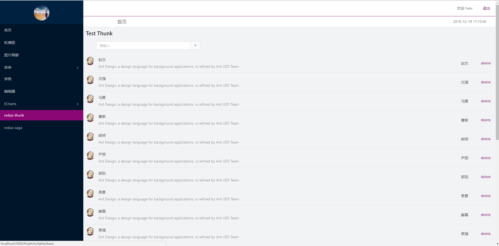
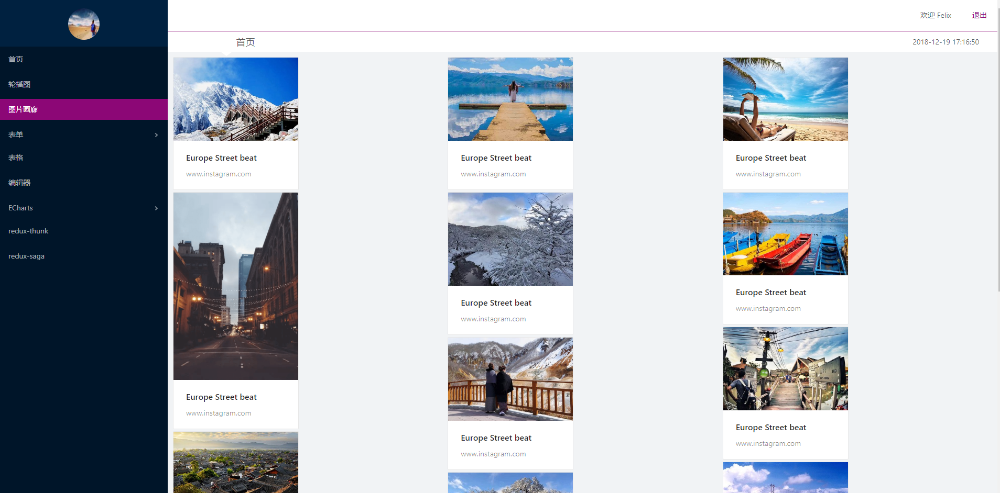
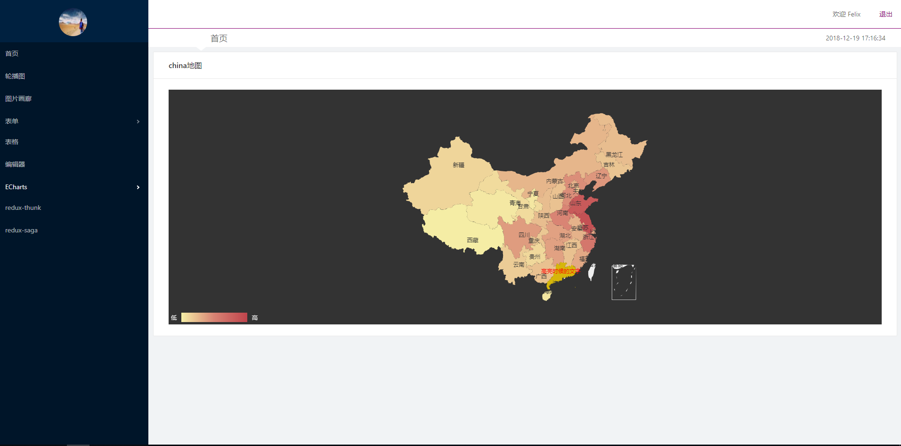

### 拉取仓库代码报错
create-react-app 是一个全局的命令行工具用来创建一个新的项目,react-scripts 是一个生成的项目所需要的开发依赖，执行 npm install react-scripts。
### state和props的区别
state和props的主要区别在于props是不可以改变的，而state可以根据交互来进行修改。这也是为什么子组件用props来传递数据的原因。
### 暴露出配置文件
npm run eject 或者yarn eject 让配置文件暴漏出来。

### config webpack.config.js 配置less。 
> webpack.config.prod.js也需要配置，不然打包正式库会报

```
 {
    test: /\.less$/,
    use: [
      require.resolve('style-loader'),
      {
        loader: require.resolve('css-loader'),
        options: {
          importLoaders: 1,
        },
      },
      {
        loader: require.resolve('postcss-loader'),
        options: {
          // Necessary for external CSS imports to work
          // https://github.com/facebookincubator/create-react-app/issues/2677
          ident: 'postcss',
          plugins: () => [
            require('postcss-flexbugs-fixes'),
            autoprefixer({
              browsers: [
                '>1%',
                'last 4 versions',
                'Firefox ESR',
                'not ie < 9', // React doesn't support IE8 anyway
              ],
              flexbox: 'no-2009',
            }),
          ],
        },
      },{
        loader:require.resolve('less-loader')
      }
    ]
}
```

### 引入antd
```
npm install antd
import 'antd/dist/antd.css'
import {Button} from 'antd'
https://www.npmjs.com/package/babel-plugin-import

```
### 按需加载  webpack.config.js 
```
npm install babel-plugin-import
test: /\.(js|jsx|mjs)$/,
            include: paths.appSrc,
            loader: require.resolve('babel-loader'),
            options: {
              plugins:[[
              'import',[{
                libraryName:'antd',
                style:true
              }]
              ]],
              cacheDirectory: true,
            }
          }
```
### less报错
>less3.x版本貌似有问题建议安装2.7.3
```
./node_modules/antd/lib/button/style/index.less
Module build failed: 
// https://github.com/ant-design/ant-motion/issues/44
.bezierEasingMixin();
npm install less@^2.7.3
```

### 配置主题  
在最下面添加options颜色配置，组件中不在需要引用颜色 import 'antd/dist/antd.css'
```
    {
        loader: require.resolve('postcss-loader'),
        options: {
          // Necessary for external CSS imports to work
          // https://github.com/facebookincubator/create-react-app/issues/2677
          ident: 'postcss',
          plugins: () => [
            require('postcss-flexbugs-fixes'),
            autoprefixer({
              browsers: [
                '>1%',
                'last 4 versions',
                'Firefox ESR',
                'not ie < 9', // React doesn't support IE8 anyway
              ],
              flexbox: 'no-2009',
            }),
          ],
        },
      },
      {
        loader:require.resolve('less-loader'),
        options: {
          modules: false,
          modifyVars: {
              "@primary-color": "#8c0776"
          }
        }
      }
    ]
  }
```
#### react的奇葩引用图片的路径，但是可以在public直接引用less中年导入less 不能少分号。
`@import '../../common/style/default.less';`

#### react-router-dom路由
```
<Route path={`${this.props.match.url}/:topicId`} component={Topic} />

import React from  'react'
import {HashRouter as Router, Route, Link} from 'react-router-dom'
export default class Topic extends React.Component{
  render(){
    return (
        <div>
          {this.props.match.params.topicId}>
        </div>
      )
  }
}
```
    
#### 由于多个平级的路由，可以使用一个最外层的App.js 来进行包裹
index => router => APP

#### react事件绑定
1. 不带参数的绑定
```
<Button type="primary" onClick={this.handleCloseLoading}>关闭</Button>
<Radio.Group value={this.state.size} onChange={this.handleChange.bind(this)}>
     handleChange = (e)=>{
         this.setState({
             size:e.target.value
         })
     }
     handleChange(e){
        this.setState({
            size:e.target.value
        })
    }
```

2. 带有参数绑定函数
```
<Button type="primary" onClick={()=>this.handleOpen('showModal1')}>基础弹框</Button>
<Button type="primary" onClick={()=>this.handleOpen('showModal1')}>基础弹框</Button>
  
  state = {
      showModal1: false,
      showModal2: false,
      showModal3: false,
      showModal4: false
  }

  // setState是一个异步的过程，同时返回一个对象，箭头函数后要加一个小括号
  handleOpen = (type) => {
      this.setState(() => ({
          [type]: true
      }), () => {
          console.log(this.state)
      });

  }
 ```
 #### 中括号运算符
  1. 中括号运算符总是能代替点运算符。但点运算符却不一定能全部代替中括号运算符。
  2. 中括号运算符可以用字符串变量的内容作为属性名。点运算符不能。
  3. 中括号运算符可以用纯数字为属性名。点运算符不能。
  4. 中括号运算符可以用js的关键字和保留字作为属性名。点运算符不能。

#### 编辑器
`npm install react-draft-wysiwyg reactjs-to-html --save`

#### react生命周期
1. 加载
```
componentWillReceiverProps(nextProps) 
shouldComponentUpdate(nextProps,netxtState)  
componentWillUpdate(nextProps,nextState)
componentWillMount-----------parent
parent.js:47 render----parent
child.js:8 componentWillMount-----------child
child.js:29 render---------child
child.js:11 componentDidMount-----------child
parent.js:16 componentDidMount-----------parent
```
2. 点击之后
```
parent.js:34 componentWillUpdate-----------parent
parent.js:53 render----parent
child.js:14 componentWillReceiveProps-----------child
child.js:20 shouldComponentUpadate-----------child
child.js:24 componentWillUpdate-----------child
child.js:30 render---------child
child.js:27 componentDidUpdate-----------child
parent.js:37 componentDidUpdate-----------parent

```

3. 当设置shouldComponent为false的时候不在执行子元素的更新。
```
componentWillUpdate-----------parent
parent.js:53 render----parent
child.js:14 componentWillReceiveProps-----------child
child.js:20 shouldComponentUpadate-----------child
parent.js:37 componentDidUpdate-----------parent
```

#### vue 父子组件的生命周期顺序
```
一、加载渲染过程
父beforeCreate->父created->父beforeMount->子beforeCreate->子created->子beforeMount->子mounted->父mounted
二、子组件更新过程
父beforeUpdate->子beforeUpdate->子updated->父updated
三、父组件更新过程
父beforeUpdate->父updated
四、销毁过程

父beforeDestroy->子beforeDestroy->子destroyed->父destroyed
```
#### router
```
HashRouter BrowserRouter
Route :path exact component render
NavLink Link
Switch
Redirect
```

#### antd 中的getFieldDecorator
```
import React from 'react';
import {Form,Card,Input,Button} from 'antd';
const FormItem=Form.Item;
 class FormLogin extends React.Component{
    render(){
        // 固定写法
        const {getFieldDecorator} =this.props.form;
        return (
            <div>
                <Card title="水平表单">
                    <Form>
                        <FormItem>
                        {
                            getFieldDecorator('userName',{
                                initialValue:"Felix",
                                rules:[]
                            })(<Input placeholder="请输入用户名" />)
                        }
                        </FormItem>
                         <FormItem>
                        {
                            getFieldDecorator('userName',{
                                initialValue:"Felix",
                                rules:[]
                            })(<Input placeholder="请输入密码" />)
                        }
 
                        </FormItem>
                         <FormItem>
                            <Button type="primary">登录</Button>
                        </FormItem>
                    </Form>
                </Card>
            </div>
            )
    }
}

export default Form.create()(FormLogin);
 getFieldDecorator  getFieldsValue  validateFields
 checkbox默认勾选（valuePropName:'checked'一定要写）
 <FormItem>
    {
        getFieldDecorator('remember',{
            initialValue:true,
            valuePropName:'checked'
        })(<Checkbox>记住密码</Checkbox>)
    }
    <a href="/">忘记密码</a>
</FormItem>
```
#### echarts
`npm install echarts echarts-for-react --save`

#### 路由报错
 Warning: Hash history cannot PUSH the same path; a new entry will not be added to the history stack
 官网似乎没有意向解决这个东西，开发环境会报错，生产环境不会。
```
  <HashRouter>
        <App>
            <Route path="/login" component={Login}/>
            <Route path="/admin" render={()=>
                <Admin>
                    <Switch>
                        <Route path="/admin/home" component={Home}/>
                        <Route path="/admin/ui/buttons" component={Button}/>
                        <Route path="/admin/ui/modals" component={Model}/>
                        <Route path="/admin/ui/gallery" component={Gallery}/>
                        <Route path="/admin/ui/carousel" component={Carousel}/> 
                        <Route path="/admin/table/basic" component={Table}/> 
                        <Route path="/admin/rich" component={Rich}/> 
                        <Route path="/admin/charts/bar" component={Bar}/>           
                        <Route component={NotMatch}></Route>
                    </Switch>
                </Admin>         
            } />
        </App>
    </HashRouter>
```
#### react报错。
~~Warning: setState(...): Can only update a mounted or mounting component. This usually means you called setState() on an unmounted component. This is a no-op~~

切换路由时候，组件已经销毁了，但是组建中的一些异步操作还存在setState操作,可以在生命周期componentWillUnmount处理。
1. ajax请求  $.ajax.abort()
2. 定时器  clearTimeout(timer)
```
  componentDidMount(){
    this.setState({
      userName:"Felix"
    });

    this.timer=setInterval(()=>{
      let sysTime=Util.formateDate(new Date().getTime())
      this.setState({
        sysTime
      })
    },1000)

    this.getWeatherAPIData();
  }

  componentWillUnmount(){
    // this.setState({},()=>{
    //   return;
    // })
    clearInterval(this.timer);
  }
```


#### Function__proto__===Function.prototype
是不是可以说Function也是Function本身的一个实例呢？这个具体该怎么理解js这种设计理念呢，Function是不是既充当鸡又充当蛋呢。。。

你能理解Array.proto === Function.prototype 为什么不能理解 Function.proto === Function.prototype呢？


#### 静态作用域

var value = 1;
function foo() {
    console.log(value);
}
function bar() {
    var value = 2;
    foo();
}

bar(); //1 

> 执行 foo 函数，先从 foo 函数内部查找是否有局部变量 value，如果没有，就根据书写的位置，查找上面一层的代码，也就是 value 等于 1，所以结果会打印 1。


#### 变量作用域提升
```
var x = 21;
var talk = function () {
    console.log(x);
    var x = 20;
};

talk ();// undefined 变量声明提升了 ，但是还没赋值
```

#### 基本类型和引用类型的传参
```
var a = 1;
function f(b) {
  b = 2;
}
f(a); // a == 1

var a = [1, 3];
function f(b) {
  b.push(2);
}
f(a); // a == [1,3,2]

var a = {k: 12};
function f(b) {
  a.c = 100;
}
f(a) // a == {k:12,c:100}

// 所以修改 o.value，可以通过引用找到原值，但是直接修改 o，并不会修改原值。所以第二个和第三个例子其实都是按共享传递
var obj = {
    value: 1
};
function foo(o) {
    o = 2;
    console.log(o); //2
}
foo(obj);
console.log(obj.value) // 
```

#### 返回值
```
function fn3 () {
  return true
}

function fn2 () {
  fn3()
}

function fn1 () {
  fn2()
}

fn1() // undefined

function fn3 () {
  return true
}

function fn2 () {
  return fn3()
}

function fn1 () {
  return fn2()
}

fn1() // true
```

#### 闭包
```
var data = [];

for (var i = 0; i < 3; i++) {
  data[i] = function () {
    console.log(i);
  };
}

data[0]();
data[1]();
data[2]();
```
> 结果都是打印3。 for循环var 关键词换成 let 或者直接返回一个函数
```
var data = [];
for (var i = 0; i < 3; i++) {
  data[i] = function (i) {
    return function (){console.log(i)};
  }(i);
}

```

#### 路由跳转
`this.props.history.push('/admin');`

#### echarts

```
（
1） 设置整个图表的大小位置使用grid属性
grid: {
        设置图标整体的大小

        // x: '20%',   x,y表示左上角的相对位置，
        // y: 100,
        // x2: 200,   x2,y2表示右下角的相对位
        // y2: 100,
        width: '50%',
        宽度设置
        left: '30%',
        left设置
        // containLabel: true
    },

    （2） 坐标轴xAxis、 yAxis
xAxis: {
        show: true,
        设置显示隐藏坐标轴
        type: 'category',
        设置坐标轴类型， 共category， value， time三种类型
        boundaryGap: true,
        设置是否在图形开始处于y轴留有间距
        // position:'top',     设置x轴的位置在顶端
        axisLine: {
            onZero: false,
            设置x轴不以y轴的0点开始
            lineStyle: {
                设置 x轴的样式
                color: 'red',
                width: 2,
                type: 'solid'
            }

        },
        axisTick: {
            show: true,
            设置x轴上标点显示
            length: 10,
            设置x轴上标点显示长度
            lineStyle: {
                设置x轴上标点显示样式
                color: 'red',
                width: 2,
                type: 'solid'
            }
        },

        axisLabel: {
            设置标点内容显示样式
            show: true,
            rotate: 45,
            设置标点内容45度倾斜显示
            margin: 30,
            textStyle: {
                color: 'blue',
                fontFamily: '微软雅黑'
            },

            formatter: function(val) {
                设置显示data中的内容， 可以传函数val是data中元素
                return val + '函数'
            }
        },
        splitLine: {
            设置x轴标点分割线样式
            show: true,
            lineStyle: {
                color: 'skyblue',
                type: 'dashed',
                width: 1
            }
        },

        splitArea: {
            设置x轴标点分割区域样式
            show: true,
        },

        name: '星期',
        data: ['周一', '周二', {
            可以将数据设置成对象， 单独设置样式
            value: '周三',
            textStyle: {
                color: 'red',
                fontSize: 30,
                fontWeight: 'bold'
            }

        }, '周四', '周五', '周六', '周日']
    },

    yAxis: {
        type: 'value',
        max: 20,
        设置y轴的最大值
        axisLabel: {
            formatter: '{value} °C'
        }
    },

    （3） 数据显示series① 折线显示
series: [{
    name: '最低气温',
    type: 'line',
    设置数据显示为折线
    symbol: 'image://https://www.baidu.com/img/bd_logo1.png',
    设置折线上标记点的样式， 可以引用图片， 也可以写star
    symbolSize: 30,
    设置标记大小
    showAllSymbol: true,
    设置显示所有标记
    smooth: true,
    设置折线图平滑显示
    legendHoverLink: false,
    关闭选择不同折线图时的高亮效果
    data: [1, -2, 2, 5, {
        单独设置某个数据的样式
        value: 3,
        symbolSize: 50
    }, 2, 0],
    itemStyle: {
        设置折线图的样式
        normal: {
            设置默认样式
            color: 'black',
            lineStyle: {
                width: 3,
                color: 'green'
            },
            areaStyle: {
                设置折线图与坐标进行填充
                color: 'yellow'
            },

            label: {
                show: true,
                position: 'bottom',
                设置折线上标记数据在下方显示
                textStyle: {
                    color: 'red'
                }
            }
        },
        emphasis: {
            设置鼠标移动到数据上时的， 强调显示效果
            label: {
                show: true,
                position: 'top',
                textStyle: {
                    color: 'gray'
                }
            }
        }
    }
}]

② 柱形图显示
dataZoom: {
        开启数据图缩放功能
        show: true
    },

    series: [{
            name: '蒸发量',
            type: 'bar',
            barGap: '-50%',
            设置相同标记位柱形图之间的相对位置
            barCategoryGap: '20%',
            设置不同标记位柱形图之间的位置
            barWidth: 10,
            设置柱形图的宽度
            data: [2.0, 4.9, 7.0, 23.2, 25.6, 76.7, 135.6, 162.2, 32.6, 20.0, 6.4, 3.3],
            markPoint: {
                data: [{
                    type: 'max',
                    name: '最大值'
                }, {
                    type: 'min',
                    name: '最小值'
                }]
            },
            markLine: {
                data: [{
                    type: 'average',
                    name: '平均值'
                }]
            }
        },

        （
        4） title标题
        title: {
            text: '某地区蒸\n发量和降水量',
            \n表示换行
            subtext: '纯属虚构',
            副标题
            x: 100,
            x,
            y表示标题的位置设置， 可以为left等
            y: 200
        },

        （
        5） legend图例
        legend: {
            data: [{
                可单独设置数据的样式， 加入”” 空字符串可实现换行
                name: '蒸发量',
                icon: 'image://https://www.baidu.com/img/bd_logo1.png',
                替换图标
                textStyle: {
                    color: 'green',
                    fontWeight: 'bold'
                }

            }, '降水量'],

            borderColor: 'red',
            formatter: '{name}Echarts',
            设置模板显示， 也可以写函数
            itemWidth: 20,
            设置图例样式的宽
            itemHeight: 20,
            设置图例样式的高
            selected: { '降水量': false },
            textStyle: { color: 'blue' } 设置图例文字的颜色
        },

        （
        6） 数据拖拽显示条dataZoom
        dataZoom: {
            show: true,
            realtime: false,
            关闭实时变化功能
            start: 40,
            设置开始和结束的范围
            end: 60,
            zoomLock: true 开启锁定范围的功能
        },

        （
        7） 数据显示提示框tooltip（ 可自定义formatter， 多级显示）
        tooltip: {
            // trigger: 'axis',
            trigger: 'item',
            只当鼠标经过数据时显示
            showContent: false,
            关闭数据详细信息框
            showDelay: 0,
            关闭显示延迟
            transitionDuration: 0,
            关闭动画延迟效果
            hideDelay: 1000,
            设置鼠标离开后延迟消失效果
            axisPointer: {
                设置背景提示样式， 有cross、 line、 shadow三种
                type: 'shadow',
                lineStyle: {
                    设置line样式的具体内容
                    color: 'red'
                },

                crossStyle: {
                    color: 'green'
                },
                shadowStyle: {
                    color: 'rgba(150, 150, 150, 0.3)'

                }
            }
        },

        （
        8） 饼图 {

            name: '访问来源',
            type: 'pie',
            radius: ['40%', '55%'],
            设置两个值， 可变为环形图
            // startAngle: 0,      设置起始角度
            clockWise: false,
            设置逆时针转动
            data: [{
                value: 335,

                name: '直达'

            }, {
                value: 310,
                name: '邮件营销'
            }, {
                value: 234,
                name: '联盟广告'

            }, {
                value: 135,
                name: '视频广告'

            }, {
                value: 1048,
                name: '百度',
                textStyle: {
                    align: 'left'
                }

            }, {
                value: 251,
                name: '谷歌'
            }, {
                value: 147,
                name: '必应'
            }, {
                value: 102,
                name: '其他'
            }]
        }

```

#### 打包报错
Import in body of module; reorder to top  import/first
import 必须在其它所有业务代码前面，检查“ ./src/form/form.js ”是否是const语句在import语句前。


// 在使用JXS的语法中一定要有React，因为JSX语法被转译必须需要React。
// react 判断一个元素是HTML标签还是组件的的原则就是看第一个字母是否是大写。
// props是对外的，state是组件本身的，不应该尝试去改变props的值。一个子组件不应该尝试去改变父组件的值，否则可能发生混乱。
// 如果一个组件需要定义自己的构造函数，一定要在构造函数（constructor）的第一行调用父类（super（this）），也就是React.component的构造函数，否则类的实例无法通过this.props来调用父组件传递过来的props。
// propTypes验证

// ChildComponent.propTypes={
//   name:PropTypes.string.isRequired,
//   age:PropTypes.number
// }


// 如果参数中  promise 有一个失败（rejected），此实例回调失败（reject），失败原因的是第一个失败 ,成功按顺序返回

// var p1 = new Promise((resolve, reject) => {
//   resolve('成功了1')
// });

// var p2 = new Promise((resolve, reject) => {
//   resolve('成功了2')
// });

// var p3 = Promise.reject('失败');

// Promise.all([p1, p2]).then(res => console.log(res)); //       ["成功了1", "成功了2"]
// Promise.all([p2, p1]).then(res => console.log(res)); //       ["成功了2", "成功了1"]
// Promise.all([p1, p2, p3]).then(res => console.log(res)); //   Promise {<rejected>: "失败"}

// constructor什么时候使用，当想要使用state时候或者bind this指定的时候

// nginx配置跨域之后每次访问会发送两次请求 https://blog.csdn.net/qq_35224032/article/details/82179428
// 第一个OPTIONS的请求是由Web服务器处理跨域访问引发的。
// OPTIONS是一种“预检请求”，浏览器在处理跨域访问的请求时如果判断请求为复杂请求，则会先向服务器发送一条预检请求，根据服务器返回的内容浏览器判断服务器是否允许该请求访问。
// 如果web服务器采用cors的方式支持跨域访问，在处理复杂请求时这个预检请求是不可避免的。


#### react的生命周期包括装载过程(Mount),更新过程(Update)和卸载过程(Unmount)。
> 装载过程
1. constructor  初始化state和this的绑定。
2. getInitState。
3. getDefaultPorps 此两种方法在Es6中不需要调用，在es5React.createClass 中才会使用到。
4. render，所有的函数都可以不写，因为React.Component已经实现了，但是render一定要写。如果没有东西return，那就返回null或者false，告诉React此次不需要渲染。
5. componentWillMount componentDidMount 位于render函数之间，componentWillMount可以在服务端渲染也可以在客户端渲染。

> 更新过程
1. componentWillReceiveProps(nexProps)
2. shouldComponentUpdate(nextProps,nextState) return nextProps.a!==this.props.a  || nextState.b!==state.b
3. componentWillUpdate
4. render 
5. componentDidUpdate

1. 并不是props发生改变才会触发componentWillReceiveProps，只要父组件更新，就会触发子组件的componentWillReceiveProps。但是通过this.setState触发的过程不会触发这个函数。？？？
```
<button onClick={ () => t his . forceUpdate () )> 
    Click me to repaint! 
</button> 

```
> 卸载过程
1. componentWillUnmount 处理定时器 ajax请求等，防止内存泄漏。


#### Flux单向数据流
Flux 应用包含四个部分，我们先粗略了解一下：
1. Dispatcher处理动作分发，维持 Store 之间的依赖关系；
2. Store负责存储数据和处理数据相关逻辑
3. Action驱动 Dispatcher JavaScript 对象；
4. View视图部分，负责显示用户界面。

#### Flux
Flux 的基本原则是单向数据流,Redux 在此基础上强调 个基本原则：
1. 唯一数据源（ Single Source of Truth); 
2. 保持状态只读（ State is read-only); 
3. 数据改变只能通过纯函数完成（Changes are made with pure functions)

Redux库提供的 create Store 函数，这个函数第一个参数代表更新状态的 reducer ，第二个参数是状态的初始值，第三个参数可选，代表 Store Enhancer。
```
componentDidMount() { 
    store subscribe(this.onChange);
}
componentWillUnmount() { 
    store.unsubscribe(this.onChange); 
}
```

#### react-redux
react-redux 的两个最主要功能：
1. connect ：连接容器组件和傻瓜组件
2. Provider ：提供包含 store context

import {Provider) from 'react-redux';

redux提供combineReducers方法可以将多个reducers合并
combineReducers({
    A:A1,
    B:B1
});

#### reducer
reducer(previousState,action)
1. 是一个纯函数，没有副作用，只负责计算状态。
2. redux我们推荐按功能分，而不是按照MVC的方式。

### 性能优化
1. shouldComponentUpdate(nextProps,nextState) return nextProps.a!==this.props.a  || nextState.b!==state.b
2. 如果react组建很多的话，上面这种会效率很低下，所以推荐react-redux。
>export default connect(mapStateToProps,mapDispathToProps)(Foo);
直接导出connect是一个无名的React组建类，其内部会进行props和上次props的对比，定制了shouldComponentUpdate函数的实现。
3. react-redux采用的是浅层次比较，如果是字符串之类的可以精准判断，如果是对象，则每次都会shouldComponentUpdate。
这其实是一个普遍接受的做法，如果递归对每个字段深层次比较，不光让代码更加复杂，也可能造成性能问题。